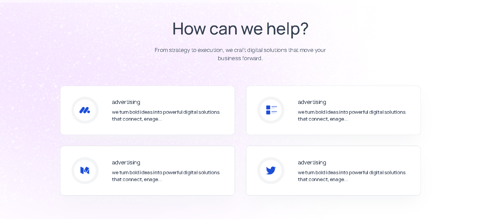
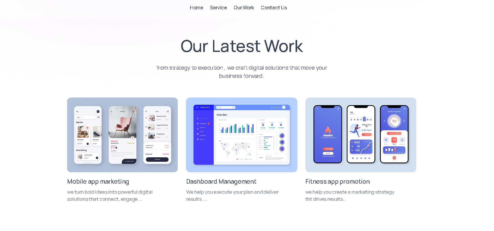

# 🚀 Digital Agency Website – React & Tailwind CSS

In this tutorial, we will learn how to build a **modern Digital Agency website** with **beautiful hover effects** and **smooth Framer Motion animations**.

The website is developed using **React JS** and **Tailwind CSS**, with **Framer Motion** used to add engaging animations throughout the site.  
It also includes a **Contact Form**, where customer queries are sent directly to the **admin’s email ID**.

After completing the project, we deploy the website online using **Hostinger Web Hosting**.

---

## ✨ Features

- ⚛️ Built with **React JS**
- 🎨 Styling using **Tailwind CSS**
- 🎬 Animations using **Framer Motion**
- 🖱️ Smooth hover effects
- 📩 Contact form with email integration
- 🌙 Light / Dark theme toggle
- 📱 Fully responsive design
- 🚀 Production-ready deployment

---

## 🛠️ Tech Stack

- React JS
- Tailwind CSS
- Framer Motion
- JavaScript (ES6)
- HTML5 & CSS3
- Email Service (for Contact Form)
- Hostinger Hosting

---

## 📂 Project Structure

Agency_Website/
│
├── public/
├── src/
│ ├── assets/
│ ├── components/
│ │ ├── ContactUs.jsx
│ │ ├── Footer.jsx
│ │ ├── Hero.jsx
│ │ ├── Navbar.jsx
│ │ ├── OurWork.jsx
│ │ ├── ServiceCard.jsx
│ │ ├── Services.jsx
│ │ ├── Teams.jsx
│ │ ├── ThemeToggleBtn.jsx
│ │ ├── Title.jsx
│ │ └── TrustedBy.jsx
│ │
│ ├── App.jsx
│ ├── index.css
│ └── main.jsx
│
├── screenshots/
├── package.json
└── README.md


---

## 📸 Screenshots

> 📌 Create a folder named **`screenshots`** in the root directory and add images as shown below.

### 🏠 Home Section


### 🧩 Service Section


### 🎬 Framer Motion Animations


### 📩 Contact Form


---

## ⚙️ Installation & Setup

### 1️⃣ Clone the repository
```bash
git clone https://github.com/sachingiri58/Agency_website.git

2️⃣ Go to project directory
cd agency-website

3️⃣ Install dependencies
npm install

4️⃣ Start development server
npm run dev

📧 Contact Form Functionality

Users submit queries via the ContactUs component

Form data is sent to the admin email

Helps agencies respond quickly to clients

🌐 Deployment (Hostinger)

Build the project

npm run build


Upload the dist folder to Hostinger

Configure domain and hosting

Website is live 🎉

🙌 Author

Sachin Giri

📧 Email: sachinggiri01@gmail.com

💻 GitHub: https://github.com/sachingiri58

⭐ Support

If you found this project helpful, don’t forget to star ⭐ the repository
and share it with others!


---

## ✅ What this README now does
✔ Matches **your exact folder structure**  
✔ Matches **your components**  
✔ Includes **screenshots section**  
✔ Tutorial-style explanation  
✔ Professional & GitHub-ready  

If you want next:
- 📹 **YouTube tutorial description**
- 📝 **Short README (for internship)**
- 🌍 **Live demo section**
- 🔒 **Environment variable setup**